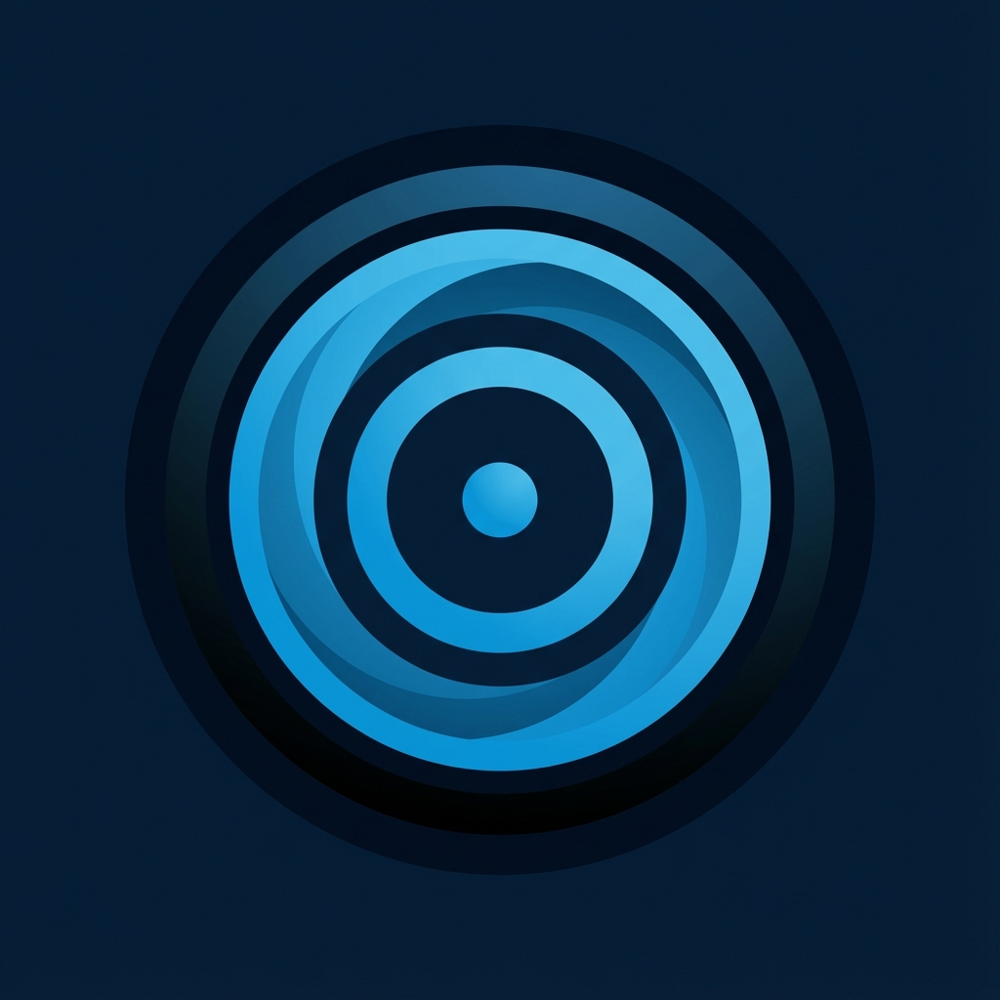

# Focus Theme

A modern productivity application designed to help you deep dive into specific topics. Set a theme, define a duration, and aggregate your learning resources in one focused place.



## 🚀 Live Demo

**[Try Focus Theme](https://ashitaka1963.github.io/FocusTheme/)**

## ✨ Features

- **Theme Management**: Define clear learning goals with start and end dates.
- **Visual Timeline**: See your active and upcoming themes in an interactive timeline view.
- **Resource Tracking**: Manage books, websites, videos, and articles. Track completion status with a checklist.
- **Progress Monitoring**: Visual progress bars and completion statistics for each theme.
- **Dark Mode UI**: A beautiful, distraction-free dark interface optimized for focus.
- **Sequential Colors**: Themes are automatically assigned distinct colors for easy identification.

## 🛠️ Tech Stack

- **Framework**: [Next.js](https://nextjs.org/) (App Router)
- **Deployment**: GitHub Pages (Static Export)
- **Styling**: CSS Modules
- **Data**: LocalStorage (persists in your browser)

## 💻 Local Development

1. Clone the repository:
   ```bash
   git clone https://github.com/ashitaka1963/FocusTheme.git
   cd FocusTheme
   ```

2. Install dependencies:
   ```bash
   npm install
   ```

3. Run the development server:
   ```bash
   npm run dev
   ```

4. Open [http://localhost:3000](http://localhost:3000) with your browser.

## 📝 License

This project is open source.

